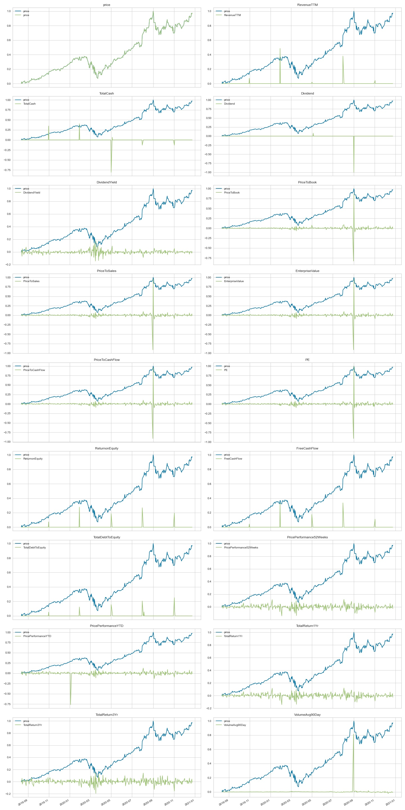
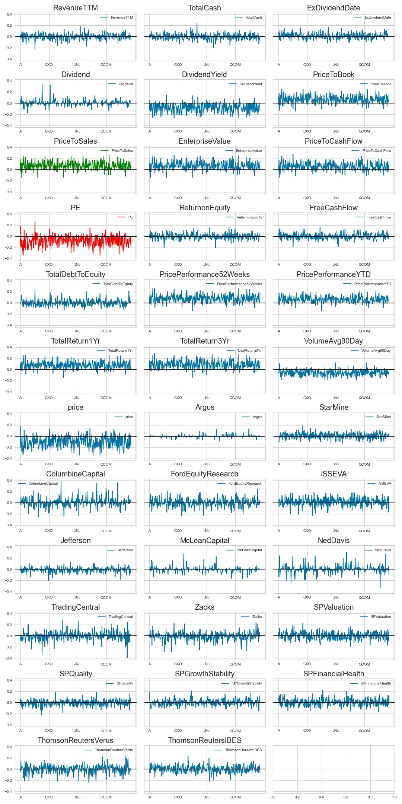
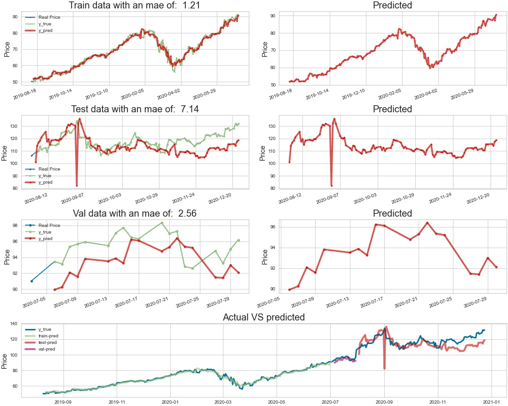
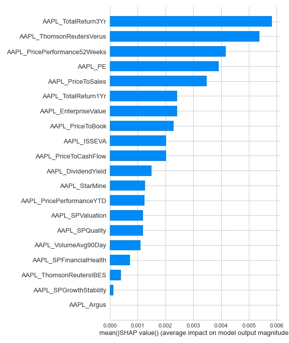
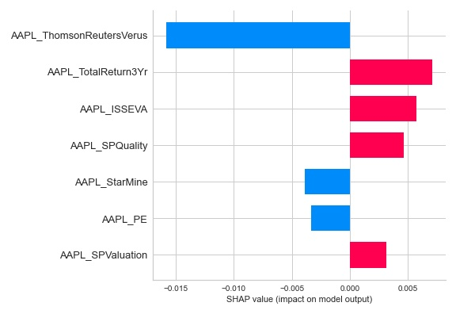

<h1>Table of Contents<span class="tocSkip"></span></h1>
<div class="toc"><ul class="toc-item"><li><span><a href="#Predicting-Stock-Data-with-an-LSTM-Network" data-toc-modified-id="Predicting-Stock-Data-with-an-LSTM-Network-1"><span class="toc-item-num">1&nbsp;&nbsp;</span>Predicting Stock Data with an LSTM Network</a></span><ul class="toc-item"><li><span><a href="#Abstract" data-toc-modified-id="Abstract-1.1"><span class="toc-item-num">1.1&nbsp;&nbsp;</span>Abstract</a></span></li><li><span><a href="#Using-the-OSEMN-Process" data-toc-modified-id="Using-the-OSEMN-Process-1.2"><span class="toc-item-num">1.2&nbsp;&nbsp;</span>Using the OSEMN Process</a></span></li><li><span><a href="#This-repository-contains" data-toc-modified-id="This-repository-contains-1.3"><span class="toc-item-num">1.3&nbsp;&nbsp;</span>This repository contains</a></span></li></ul></li><li><span><a href="#Scrubbing-the-data" data-toc-modified-id="Scrubbing-the-data-2"><span class="toc-item-num">2&nbsp;&nbsp;</span>Scrubbing the data</a></span><ul class="toc-item"><li><span><a href="#Prices" data-toc-modified-id="Prices-2.1"><span class="toc-item-num">2.1&nbsp;&nbsp;</span>Prices</a></span></li><li><span><a href="#Splits" data-toc-modified-id="Splits-2.2"><span class="toc-item-num">2.2&nbsp;&nbsp;</span>Splits</a></span></li><li><span><a href="#Performance" data-toc-modified-id="Performance-2.3"><span class="toc-item-num">2.3&nbsp;&nbsp;</span>Performance</a></span></li><li><span><a href="#Company" data-toc-modified-id="Company-2.4"><span class="toc-item-num">2.4&nbsp;&nbsp;</span>Company</a></span></li><li><span><a href="#Analyst" data-toc-modified-id="Analyst-2.5"><span class="toc-item-num">2.5&nbsp;&nbsp;</span>Analyst</a></span></li><li><span><a href="#Combined-Company/Analyst/Performance" data-toc-modified-id="Combined-Company/Analyst/Performance-2.6"><span class="toc-item-num">2.6&nbsp;&nbsp;</span>Combined Company/Analyst/Performance</a></span></li></ul></li><li><span><a href="#Visualzations" data-toc-modified-id="Visualzations-3"><span class="toc-item-num">3&nbsp;&nbsp;</span>Visualzations</a></span><ul class="toc-item"><li><span><a href="#Our-SP500" data-toc-modified-id="Our-SP500-3.1"><span class="toc-item-num">3.1&nbsp;&nbsp;</span>Our SP500</a></span></li><li><span><a href="#Comparing-our-scraped-AAPL-price-to-yahoo-finance" data-toc-modified-id="Comparing-our-scraped-AAPL-price-to-yahoo-finance-3.2"><span class="toc-item-num">3.2&nbsp;&nbsp;</span>Comparing our scraped AAPL price to yahoo finance</a></span></li><li><span><a href="#AAPL-differencing-of-features-compared-to-price" data-toc-modified-id="AAPL-differencing-of-features-compared-to-price-3.3"><span class="toc-item-num">3.3&nbsp;&nbsp;</span>AAPL differencing of features compared to price</a></span></li><li><span><a href="#Positive-and-negative-correlations-to-price" data-toc-modified-id="Positive-and-negative-correlations-to-price-3.4"><span class="toc-item-num">3.4&nbsp;&nbsp;</span>Positive and negative correlations to price</a></span></li><li><span><a href="#Lack-of-overall-correlations" data-toc-modified-id="Lack-of-overall-correlations-3.5"><span class="toc-item-num">3.5&nbsp;&nbsp;</span>Lack of overall correlations</a></span></li></ul></li><li><span><a href="#First-model" data-toc-modified-id="First-model-4"><span class="toc-item-num">4&nbsp;&nbsp;</span>First model</a></span><ul class="toc-item"><li><span><a href="#Base-model-predictions" data-toc-modified-id="Base-model-predictions-4.1"><span class="toc-item-num">4.1&nbsp;&nbsp;</span>Base model predictions</a></span></li><li><span><a href="#Manually-tuned-model-predictions" data-toc-modified-id="Manually-tuned-model-predictions-4.2"><span class="toc-item-num">4.2&nbsp;&nbsp;</span>Manually tuned model predictions</a></span><ul class="toc-item"><li><span><a href="#Interpretation-totals" data-toc-modified-id="Interpretation-totals-4.2.1"><span class="toc-item-num">4.2.1&nbsp;&nbsp;</span>Interpretation totals</a></span></li><li><span><a href="#Interpretation-value" data-toc-modified-id="Interpretation-value-4.2.2"><span class="toc-item-num">4.2.2&nbsp;&nbsp;</span>Interpretation value</a></span></li></ul></li><li><span><a href="#Auto-tuned-model-predictions" data-toc-modified-id="Auto-tuned-model-predictions-4.3"><span class="toc-item-num">4.3&nbsp;&nbsp;</span>Auto-tuned model predictions</a></span></li></ul></li><li><span><a href="#Hyper-parameter-tuning-methodology" data-toc-modified-id="Hyper-parameter-tuning-methodology-5"><span class="toc-item-num">5&nbsp;&nbsp;</span>Hyper-parameter tuning methodology</a></span><ul class="toc-item"><li><span><a href="#tune.py" data-toc-modified-id="tune.py-5.1"><span class="toc-item-num">5.1&nbsp;&nbsp;</span>tune.py</a></span></li><li><span><a href="#nt.tune" data-toc-modified-id="nt.tune-5.2"><span class="toc-item-num">5.2&nbsp;&nbsp;</span>nt.tune</a></span></li><li><span><a href="#NetworkBuilder" data-toc-modified-id="NetworkBuilder-5.3"><span class="toc-item-num">5.3&nbsp;&nbsp;</span>NetworkBuilder</a></span></li><li><span><a href="#tuner.search" data-toc-modified-id="tuner.search-5.4"><span class="toc-item-num">5.4&nbsp;&nbsp;</span>tuner.search</a></span></li></ul></li><li><span><a href="#Conclusion" data-toc-modified-id="Conclusion-6"><span class="toc-item-num">6&nbsp;&nbsp;</span>Conclusion</a></span><ul class="toc-item"><li><span><a href="#Next-Steps" data-toc-modified-id="Next-Steps-6.1"><span class="toc-item-num">6.1&nbsp;&nbsp;</span>Next Steps</a></span></li></ul></li><li><span><a href="#Folder-Structure" data-toc-modified-id="Folder-Structure-7"><span class="toc-item-num">7&nbsp;&nbsp;</span>Folder Structure</a></span></li><li><span><a href="#Repository-Structure" data-toc-modified-id="Repository-Structure-8"><span class="toc-item-num">8&nbsp;&nbsp;</span>Repository Structure</a></span></li></ul></div>

# Predicting Stock Data with an LSTM Network

**Author**: <a href="https://sites.google.com/skelouse.com/home/">Sam Stoltenberg</a>

## Abstract

<body>
<p>
Do you want to GET RICH QUICK?  Going this route has many heartaches, and decsision trees to traverse such as.
    <ul>
        <li>Drop some sparse columns, or fill the missing data with 0?</li>  <li>Do you <a href="https://hackernoon.com/what-is-one-hot-encoding-why-and-when-do-you-have-to-use-it-e3c6186d008f">one hot encode</a> an analyst saying "BUY", "HOLD", or map numerical values to each of the given features?</li> <li>What if there are irregularties in the price data you have, how do you fix them?</li></ul>  All of these and more are valid questions we had to answer, and have a direct effect on the predictions of our networks.  If in the end our predictions do gain profits we will become <a href="https://cryptohustle.com/market-makers-vs-market-movers/#:~:text=Market%20movers%20are%20traders%20or,that%20can%20influence%20price%20action.">market movers</a>, and eventually the market will work out the methods we are using to predict.</p>
<p>
Our data was scraped using Selenium from an investment firm consisting of analyst opinions, performance statistics, prices, and company information for 7000+ stock symbols from August, 9th of 2019 to present.   Although after cleaning our data, and dropping irregularties we end with roughly 2000 symbols.</p>

<p>We are predicting <a href="https://towardsdatascience.com/how-to-predict-a-time-series-part-1-6d7eb182b540">time series data</a>, so we have to define things such as the number of days to predict the next with.  The data is then transformed into multiple matrices of X_data correlating to y_targets.  The X_data being all of the data from n day(s) before, and the y_targets being the data we are trying to predict. If one wanted to know the information two days ahead they would have to predict all of the data for one day then use the predicted data to predict the next, or structure the data in such a way where one day is being used to predict two.</p>
    
<p>Our first networks had infinite loss due to predicting everything as 0, so we had to devise a method for creating the best network to use on the data.  There are few `plug-and-play` methods for tuning neural networks, and especially tuning Time Series predicting networks.  The method we did find was a Hyperband from <a href="https://keras-team.github.io/keras-tuner/">kerastuner</a>.  The Hyperband takes a build function and inside of the build function one can use a Hyperband choice function which reports back to the Hyperband what effect a given quotient had on the validation loss of the network.  Our **NetworkTuner** can tune items such as:
<ul>
    <li>n_input (number of days to use in the prediction)</li>
    <li>Columns (which of the given columns to use in the prediction)</li>
    <li>Scale or not to scale the data between 0 and 1</li>
    <li>How many neurons to use in any given layer</li>
    <li>How much regularization if any to use, and which type</li>
    </ul>
</p>
<p>
    With the Hyperband we also developed a <a href="https://scikit-learn.org/stable/modules/cross_validation.html">cross validation</a> method, as kerastuner does not supply one out of the bag for time series.  Cross validation ensures that the parameters are not being tuned solely for one set of testing data.  K validation sets are also held back throughout the tuning process to test the network at the end of tuning.</p>
</body>

## Using the OSEMN Process
- Obtain the data
- Scrub the data
- Explore the data
- Model the data
- Interpret the data
- <a href="https://machinelearningmastery.com/how-to-work-through-a-problem-like-a-data-scientist/">Reference</a>

## This repository contains

 -  A Jupyter notebook <a href="https://github.com/skelouse/capstone-stock-analysis/blob/master/main.ipynb">`main.ipynb`</a> detailing my EDA and neural network processes
 
 
 - A technical <a href="https://github.com/skelouse/capstone-stock-analysis/blob/master/presentation.pdf">`presentation.pdf`</a> of the project.
 
 
 - A python script <a href="https://github.com/skelouse/capstone-stock-analysis/blob/master/tune.py">`tune.py`</a> which is ran from a shell with:
```
python tune.py [name_of_network]
# name_of_network being a predefined name correlating to a 
# function that tunes that specific network on predefined 
# hyper-parameters
```

 -  A Jupyter notebook <a href="https://github.com/skelouse/capstone-stock-analysis/blob/master/Pull%20and%20clean%20data.ipynb">`Pull and clean data.ipynb`</a> for pulling and replacing all of the pickles of data, refreshing data in the 'stock_cleaned' SQL server, and refreshing the Firebase database. 


- Folder <a href="https://github.com/skelouse/capstone-stock-analysis/blob/master/db">`db`</a> with files <a href="https://github.com/skelouse/capstone-stock-analysis/blob/master/db/firebase.py">`firebase.py`</a> and <a href="https://github.com/skelouse/capstone-stock-analysis/blob/master/db/database.py">`database.py`</a> for connecting to and posting to Google Firebase and our SQL server.


- Folder <a href="https://github.com/skelouse/capstone-stock-analysis/blob/master/modeling">`modeling`</a> with files:
  - <a href="https://github.com/skelouse/capstone-stock-analysis/blob/master/modeling/build.py">`build.py`</a> 
with class **NetworkBuilder** which takes parameters that directly correlate to how a network is put together.  This class is also used for tuning those same parameters.

  - <a href="https://github.com/skelouse/capstone-stock-analysis/blob/master/modeling/create.py">`create.py`</a> 
with class **NetworkCreator** that does everything from preparing the time series data to creating an html report on how well the model performed on the train, test, and validation data.

  - <a href="https://github.com/skelouse/capstone-stock-analysis/blob/master/modeling/sequential.py">`sequential.py`</a> 
with class **CustomSequential** for wrapping a keras Sequential model and overriding its fit function to implement a custom cross validation method.

  - <a href="https://github.com/skelouse/capstone-stock-analysis/blob/master/modeling/tuner.py">`tuner.py`</a> 
with class **NetworkTuner** for tuning a neural network's architecture, and data processing methods.


- Folder <a href="https://github.com/skelouse/capstone-stock-analysis/blob/master/old">`old`</a> (unorganized) with files:

  - <a href="https://github.com/skelouse/capstone-stock-analysis/blob/master/old/Old%20Modeling.ipynb">`Old Modeling.ipynb`</a> 
Which is a Jupyter Notebook where I failed to predict on all of the data

  - <a href="https://github.com/skelouse/capstone-stock-analysis/blob/master/old/Old%20main.ipynb">`Old main.ipynb`</a> 
Which is my original Jupyter Notebook containing the scrubbing process, and attempts at modeling

  - <a href="https://github.com/skelouse/capstone-stock-analysis/blob/master/old/Old%20main2.ipynb">`Old main2.ipynb`</a> 
Which is a Jupyter Notebook showing my attempt at predicting all of the data from three sides before realizing it was impossible with my single GPU, and that company info is irrelevant there since it is unchanging.

  - <a href="https://github.com/skelouse/capstone-stock-analysis/blob/master/old/Pull%20and%20update%20data.ipynb">`Pull and update data.ipynb`</a> 
Which is an almost working notebook for updating the data rather than pulling it all and updating everything.

  - <a href="https://github.com/skelouse/capstone-stock-analysis/blob/master/old/scratch.ipynb">`scratch.ipynb`</a> 
Which is a Jupyter Notebook showcasing where I really dug into Time Series data, exactly what the generator was doing, and forecasting.

- Folder <a href="https://github.com/skelouse/capstone-stock-analysis/blob/master/reports">`reports`</a> containing HTML reports of how each model performed, and which columns directly effected their performance.

- File <a href="https://github.com/skelouse/capstone-stock-analysis/blob/master/styles/custom.css">`styles/custom.css`</a> containing the css used to style the jupyter notebooks
 
 
 - Folder <a href="https://github.com/skelouse/capstone-stock-analysis/blob/master/test_notebooks">`test_notebooks`</a> (unorganized) with files:

  - <a href="https://github.com/skelouse/capstone-stock-analysis/blob/master/test_notebooks/Firebase%20Test.ipynb">`Firebase Test.ipynb`</a> 
Which is a Jupyter Notebook

  - <a href="https://github.com/skelouse/capstone-stock-analysis/blob/master/test_notebooks/Prediction_testing.ipynb">`Prediction_testing.ipynb`</a> 
Which is a Jupyter Notebook testing predictions with my old method of greek god named models.

  - <a href="https://github.com/skelouse/capstone-stock-analysis/blob/master/test_notebooks/dashboard_test.ipynb">`dashboard_test.ipynb`</a> 
Which is a Jupyter Notebook with my first tests of plotly graphs and my scraped data for my <a href="https://sql-viewer.herokuapp.com/">Website</a>

  - <a href="https://github.com/skelouse/capstone-stock-analysis/blob/master/test_notebooks/model_scratch_testing.ipynb">`model_scratch_testing.ipynb`</a> 
Which is a Jupyter Notebook containing the actual function tests that were used in the beginning development of my **NetworkCreator** class.


# Scrubbing the data
  <h2>Prices</h2>
    <ul>
        <li>Reindex to valid dates 2019-08-09 => onwards without the four days that have very little data '2019-12-09', '2020-06-23', '2020-06-24', '2020-06-25'</li>
        <li>Forward interpolate the data with a limit of three days.  So if 6-25 was a valid price, and the four days after were null it would fill the first three, but not the third</li>
        <li>Drop symbols with null values</li>
        <li>Post to <code>stock_cleaned</code> SQL server</li>
        <li>Pickle</li>
    </ul>
    <h2>Splits</h2>
    <ul>
        <li>Make an apply column which is `num`/`den`</li>
    </ul>
    <h2>Performance</h2>
    <ul>
        <li>Load in performance and clean</li>
        <li>Drop symbols not in price symbols</li>
        <li>Match index to price index</li>
        <li>Fill null ExDividend dates with 1970-01-01 then encode days since then for numerical data</li>
        <li>Decide columns to fill, and columns to fill then drop if the symbol still has null values</li>
        <li>Interpolate null values for both, fill na for columns to fill</li>
        <li>Drop columns with negative min that still have many null values</li>
        <li>Drop symbols that still have null values in the columns with a negative minimum as filling with 0 not be adequate.</li>
        <li>Add price to performance</li>
        <li>Apply splits</li>
        <li>Separate out penny stocks ( stocks where price is < 1 dollar )</li>
        <li>Post to <code>stock_cleaned</code> SQL server</li>
        <li>Pickle penny and non-penny performances</li>
    </ul>
    <h2>Company</h2>
    <ul>
        <li>Split out symbols that are in performance symbols</li>
        <li>Fill null text values with `unknown`</li>
        <li>Pickle.</li>
    </ul>
    <h2>Analyst</h2>
    <ul>
        <li>Interpolate null values by symbol, then fill the rest with 0</li>
        <li>Map text values to numeric</li>
        <li>Convert all to float</li>
        <li>Post to <code>stock_cleaned</code> SQL server</li>
        <li>Pickle</li>
    </ul>
    <h2>Combined Company/Analyst/Performance</h2>
    <ul>
        <li>One hot encode Company</li>
        <li>Combine the three dataframes into one</li>
    </ul>
    <p><b>After the process is complte, we update Firebase for website with performance and performance penny,  possibly company and analyst if added later</b></p>


# Visualzations

## Our SP500
> This is an average of our SP500 prices you can clearly see the covid-19 dip in march


## Comparing our scraped AAPL price to yahoo finance
> As you can see below, our data is not perfect as it is only collected once per day, but we have many more features then we know what to do with.


©2020 Verizon Media.

## AAPL differencing of features compared to price
> Here we differenced each feature so that the 2nd day is now (1st day) subtracted from (2nd day) and so on.  We then plot that on the same scale as price to see if there are any indicators of price jumps, and to check the vitality of our data.



<div class="alert alert-warning">
  <strong>About the plot:</strong>
    <ul>
        <li>You can see when appl price split in `VolumeAvg90Day` peaked.
        </li>
        <li>Features such as `ReturnonEquity` are quarterly reports, thus they are showing differencing on the quarters.</li>
    </ul>
</div>

## Positive and negative correlations to price
> Pay special attention to the columns in red and green as they are showing negative and positive correlation to price the next day.



<div class="alert alert-warning">
  <strong>About the plot:</strong>
        You can see for VLO( Valero ) <span style="color:red">`PE`, in red</span> has a negative correlation to price, and a positive correlation to price <span style="color:green">in green , `PriceToSales`</span>.
</div>

## Lack of overall correlations
> Here we took the overall prediction quality of each column, and plotted their sum qualities for each symbol.
> The quality was determined by how well a given feature correlated to changes in all of the other features.


<div class="alert alert-warning">
  <strong>About the plot:</strong>
        In red you can see the columns that we dropped.  They are overall more normally distributed, thus not useful in predicting what tomorrow's price is going to be
</div>

# First model

## Base model predictions


<div class="alert alert-warning">
  <strong>About the plot!</strong>
    <ul>
        <li>The network is not doing too well at predicting the test or validation data</li>
        <li>Drop in quality of the testing data is showing through, as AAPL had a split in September of 2020</li>
    </ul>
</div>

## Manually tuned model predictions
> After some slight manual tuning of the network here are the predictions.



<div class="alert alert-warning">
  <strong>About the plot!</strong>
    <ul>
        <li>Much better than the base model</li>
        <li>You can see the same split drop in quality here on the testing data, maybe we could remove outliers.</li>
    </ul>
</div>

### Interpretation totals
> Here we use shap to get how much each column is effecting the network



<div class="alert alert-warning shadow">
  <strong>About the plot!</strong>
    <ul>
        <li>AAPL_PE is having the greatest effect on predicting the next day</li>
    </ul>
</div>

### Interpretation value
> Here we use shap to get how each column is effecting the network



<div class="alert alert-warning shadow">
  <strong>About the plot!</strong>
    <ul>
        <li>AAPL_TotalReturn1Yr going up is predicting that price will go up.  This correlates to our correlation where AAPL_TR1YR was correlating positively to price</li>
    </ul>
</div>

## Auto-tuned model predictions
> Coming soon...

# Hyper-parameter tuning methodology
> Here we will do a simple walk through of the Hyper-parameter tuning process.

## tune.py
> Here is a small test for the tune.py you can see that there are many different parameters defined such as: 
> - `input_neurons` corresponds to how many neurons will be used in the input layer.
> - `n_days` corresponds to how many days are used for predicting the next, or the length of the TimeSeriesGenerator.
```python
import copy
import pandas as pd

# Import our NetworkTuner
from modeling.tuner import NetworkTuner

if __name__ == "__main__":
    
    # Define parameters to tune
    parameters = {
        'input_neurons': [2, 4, 8, 16],
        'input_dropout_rate': [.1, .3, .5],
        'use_input_regularizer': [0, 1, 2],
        'input_regularizer_penalty': [0.01, 0.05, 0.1, 0.3],
        'n_hidden_layers': [1, 3, 5, 8],
        'hidden_dropout_rate': [0.0, .3, .5, .9],
        'hidden_neurons': [16, 32, 64],
        'use_hidden_regularizer': [0, 1, 2],
        'hidden_regularizer_penalty': [0.01, 0.05, 0.1, 0.3],
        'patience': [5, 25, 50, 100],
        'batch_size': [32, 64, 128],
        'use_early_stopping': [0, 1],
        'n_days': [1, 2, 3]
    }
    
    # Build the test dataframe
    _list = list(range(20))
    df = pd.DataFrame({
        'apple': copy.copy(_list),
        'orange': copy.copy(_list),
        'banana': copy.copy(_list),
        'pear': copy.copy(_list),
        'cucumber': copy.copy(_list),
        'tomato': copy.copy(_list),
        'plum': copy.copy(_list),
        'watermelon': copy.copy(_list)
    })
    
    # Define which columns are feature(s) and which are the target(s)
    X_cols = list(df.columns)
    y_cols = 'banana'


# On the instantiation of NetworkTuner our data is split
# into k many folds, and then each fold is split again into
# training, testing, and validation data.

    # Instantiate our NetworkTuner
    nt = NetworkTuner(
        df=df, X_cols=X_cols,
        y_cols=y_cols, k_folds=5, max_n_days=3
    )
    
    # Call the tune function
    nt.tune(
        'Albert', max_epochs=100
    )
```

## nt.tune
> When nt.tune is ran the following function is called from **modeling.NetworkTuner**

```python
def tune(self, name, max_epochs=10, **parameters):
    """Running the tuner with kerastuner.Hyperband"""

    # Feeding parameters to tune into the build function
    # before feeding it into the Hyperband
    self.build_and_fit_model = partial(
        self.build_and_fit_model, **parameters
    )

    # Register Logger dir and instantiate kt.Hyperband
    Logger.register_directory(name)
    tuner = kt.Hyperband(self.build_and_fit_model,
                            objective='val_loss',
                            max_epochs=max_epochs,
                            factor=3,
                            directory='./tuner_directory',
                            project_name=name,
                            logger=Logger)

    # Start the search for best hyper-parameters
    tuner.search(self)

    # Get the best hyper-parameters
    best_hps = tuner.get_best_hyperparameters(num_trials=1)[0]

    # Display the best hyper-parameters
    print(f"""The hyperparameter search is complete.
    The optimal number of units in the first densely-connected layer
    {best_hps.__dict__['values']}
    """)

```

## NetworkBuilder
> The **NetworkBuilder** has a series of functions such as the below for searching the different parameters, getting each selection from the Hyperband.  Here is a small cut-out of our input layer showcasing where the Hyperband makes choices.

```python
input_neurons = hp.Choice('input_neurons', input_neurons)
model.add(LSTM(input_neurons))
```


## tuner.search
> As the tuner begins its search we move to our **CustomSequential** that is used by the **NetworkTuner** as its primary network when tuning.  The **CustomSequential** overrides tensorflow.keras.models.Sequantial fit function to implement a cross-validation split.  A simplified version of our **CustomSequential.fit** is defined as follows:

```python
def fit(self, nt, **kwargs):
    """
    Overrides model fit to call it k_folds times
    then averages the loss and val_loss to return back
    as the history.
    """

    histories = []
    h = None

    # Iterate over number of k_folds
    for k in range(1, self.k_folds+1):
        train, test, val = self.nt.n_day_gens[self.n_days][k]
        # Split data and targets
        X, y = train[0]
        X_t, y_t = test[0]

        # Calling Sequential.fit() with each fold
        h = super(CustomSequential, self).fit(
            X, y,
            validation_data=(X_t, y_t),
            **kwargs)
        histories.append(h.history)

    # Get and return average of model histories
    df = pd.DataFrame(histories)
    h.history['loss'] = np.array(df['loss'].sum()) / len(df)
    h.history['val_loss'] = np.array(df['val_loss'].sum()) / len(df)
    return h
```

# Conclusion
* Data can be manipulated in many different ways, and networks can be tuned in many different ways.  To accurately predict the stock market one would have to come across a lucky set of hyper-parameters and training set that the big players have not tried on their huge servers.  The parameters chosen would also not work forever.

* Over time if you are trading in large volumes the market would become "used" to your predictions, and the market movers would start basing their predictions off of yours, and they would become useless.

* Coming soon...

## Next Steps
> * Cluster on absolute correlation takeing correlation for different symbols.
> * Tune network on which columns are being used for predictions.
> * Tune network with vs without differencing and/or scaling.
> * Forecast tomorrow's prices

# Folder Structure
```
\--- bin
|
\--- db
|
\--- img
|
\--- modeling
\--- \--- tests
\         \--- _python
\         \--- create
\         \--- tuner
|   
\--- old
|
\--- reports
\    \--- aapl_price_w_aapl_info
\    \--- aapl_price_w_all_price
\    \--- aapl_price_w_sector
|
\--- styles
|
\--- test_notebooks
```

# Repository Structure

```
\--- bin
\    |  __init__.py
\    |  anomoly.py
\    |  database-schema.py
\    |  NN.py
\    |  out.png
\    |  correlation data csv files
|
|
\--- db
\    |  __init__.py
\    |  database.py
\    |  firebase.py
|
|
\--- img
\    |  flow.png
|
|
\--- modeling
\--- \--- tests
\         \--- _python
\              |  test_param_setting.py
\
\         \--- create
\         \--- tuner
\              |  test_cv.py
\              \-  val_folds
\    |  __init__.py
\    |  build.py
\    |  create.py
\    |  sequential.py
\    |  tuner.py
|   
|
\--- old   
\    |  Old main.ipynb
\    |  Old main2.ipynb
\    |  Old model_creation.ipynb
\    |  Old Modeling.ipynb
\    |  Pull and update data.ipynb
\    |  scratch.ipynb
\    |  scratch.py
|
|
\--- reports
\    \--- aapl_price_w_aapl_info
\    \--- aapl_price_w_all_price
\    \--- aapl_price_w_sector
|
|
\--- styles
\   |  custom.css
\   |  
|
|
\--- test_notebooks
\    |  dashboard_test.ipynb
\    |  Firebase Test.ipynb
\    |  model_scratch_testing.ipynb
\    |  Prediction_testing.ipynb
|
|  .gitignore
|  main.ipynb
|  presentation.pdf
|  Pull and clean data.ipynb
|  Readme.ipynb
|  README.md
|  run_tests.py
|  todo.txt
|  tune.py
```
